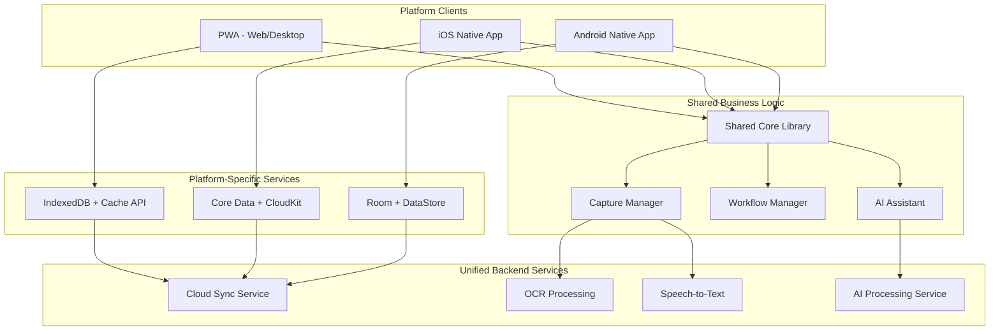
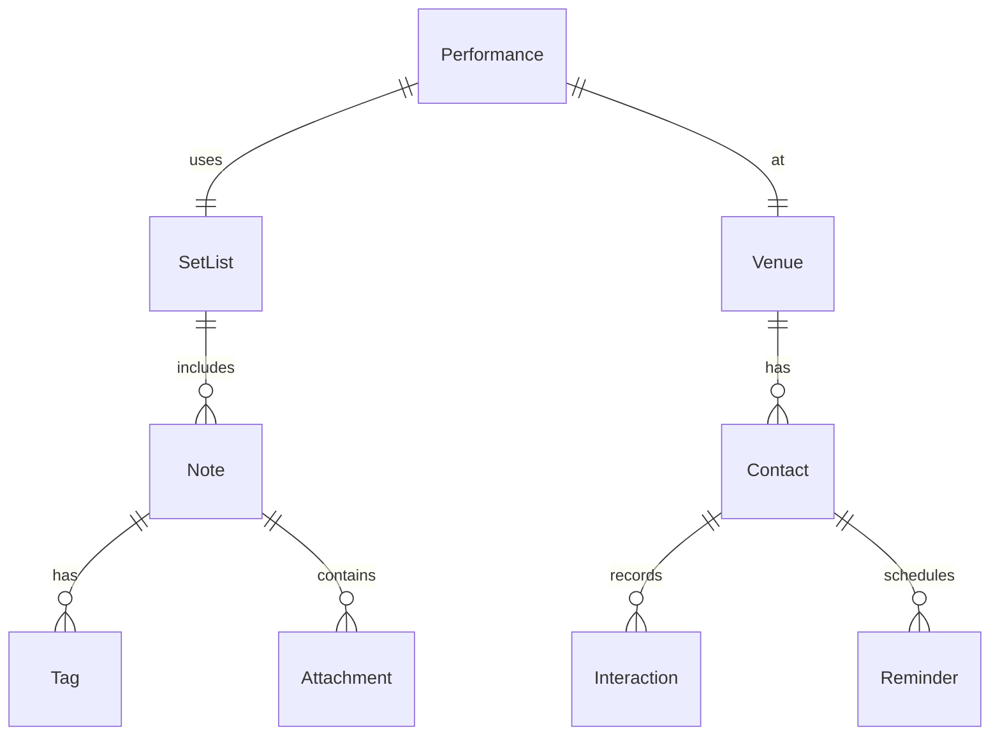

# Design Document

## Overview

Funny Notes is designed as a cross-platform creative workspace with three deployment targets: Progressive Web Application (PWA), native iOS app, and native Android app. The system employs a shared-core architecture with platform-specific optimizations, ensuring consistent functionality while leveraging each platform's unique capabilities.

The platform consists of four primary layers:
- **Platform Layer**: PWA, iOS (Swift/SwiftUI), Android (Kotlin/Jetpack Compose)
- **Presentation Layer**: Shared design system with platform-specific implementations
- **Application Layer**: Cross-platform business logic and creative workflow management
- **Data Layer**: Unified offline-first storage with platform-optimized sync

## Architecture

### Cross-Platform System Architecture



### Cross-Platform Technology Stack

#### Shared Core Architecture
**Business Logic**: TypeScript/JavaScript shared library
- Platform-agnostic business rules and workflows
- Consistent data models across all platforms
- Shared validation and processing logic

**API Layer**: GraphQL with offline-first sync
- Unified data fetching across platforms
- Optimistic updates and conflict resolution
- Subscription-based real-time updates

#### Platform-Specific Implementations

**PWA (Web/Desktop)**
- **Framework**: React 18 with TypeScript
- **State Management**: Zustand with persistence
- **Storage**: IndexedDB with Dexie.js
- **PWA Features**: Workbox for caching and offline support
- **Desktop**: Electron wrapper for enhanced desktop features

**iOS Native App**
- **Framework**: SwiftUI with Swift 5.9+
- **Architecture**: MVVM with Combine
- **Storage**: Core Data with CloudKit sync
- **Platform Features**: Siri Shortcuts, Spotlight integration, Apple Pencil support
- **Shared Logic**: JavaScript Core bridge to shared TypeScript core

**Android Native App**
- **Framework**: Jetpack Compose with Kotlin
- **Architecture**: MVVM with StateFlow/LiveData
- **Storage**: Room database with DataStore preferences
- **Platform Features**: Android Auto, Google Assistant, S Pen support
- **Shared Logic**: V8 JavaScript engine bridge to shared TypeScript core

#### Backend Services
**Cloud Infrastructure**: Firebase/Supabase for rapid development
- **Authentication**: Multi-platform OAuth and biometric auth
- **Database**: PostgreSQL with real-time subscriptions
- **Storage**: Cloud storage for media files with CDN
- **Functions**: Serverless functions for AI processing

## Components and Interfaces

### Core Components

#### 1. Capture Interface
```typescript
interface CaptureInterface {
  // Rapid input methods
  textCapture: (content: string) => Promise<Note>
  voiceCapture: (audioBlob: Blob) => Promise<Note>
  imageCapture: (imageFile: File) => Promise<Note>
  
  // Auto-save and tagging
  autoSave: boolean
  suggestTags: (content: string) => Promise<string[]>
}
```

**Design Rationale**: Multiple input modalities ensure users can capture ideas regardless of context. Auto-save eliminates friction, while AI-powered tagging reduces organizational overhead.

#### 2. Content Organization System
```typescript
interface ContentOrganizer {
  // Intelligent categorization
  categorizeContent: (note: Note) => Promise<Category[]>
  detectDuplicates: (note: Note) => Promise<Note[]>
  
  // Performance-oriented grouping
  createSetList: (notes: Note[]) => SetList
  calculateTiming: (setList: SetList) => PerformanceTiming
}
```

#### 3. Performance Workflow Manager
```typescript
interface PerformanceWorkflow {
  // Rehearsal tools
  startRehearsalMode: (setList: SetList) => RehearsalSession
  recordPractice: (session: RehearsalSession) => Promise<Recording>
  
  // Performance tracking
  logPerformance: (venue: Venue, feedback: Feedback) => Promise<void>
  analyzePerformanceData: () => Promise<PerformanceAnalytics>
}
```

#### 4. Contact and Venue Management
```typescript
interface ContactManager {
  // Relationship tracking
  addContact: (contact: Contact) => Promise<void>
  linkPerformanceToVenue: (performance: Performance, venue: Venue) => Promise<void>
  
  // Follow-up management
  createReminder: (contact: Contact, context: string) => Promise<Reminder>
  trackInteractionHistory: (contact: Contact) => Promise<Interaction[]>
}
```

### User Interface Design

#### Theme System
The UI employs a performance-themed design system with three primary visual modes:

1. **Comedy Club Mode** (Default)
   - Dark background with warm accent lighting
   - Typography inspired by vintage comedy club signage
   - Subtle stage lighting effects for focus areas

2. **Legal Pad Mode**
   - Cream background with blue ruling lines
   - Handwriting-style fonts for informal feel
   - Margin areas for quick annotations

3. **Index Card Mode**
   - Clean white cards with subtle shadows
   - Compact, scannable layout
   - Drag-and-drop organization metaphors

#### Platform-Optimized Capture Interfaces

**PWA/Desktop**
- **Floating Action Button**: Always-accessible capture entry point
- **Keyboard Shortcuts**: Global hotkeys for rapid capture
- **Voice Activation**: Web Speech API with "Hey Funny Notes" wake phrase
- **Drag & Drop**: File and text dropping from other applications

**iOS Native**
- **Siri Shortcuts**: "Add to Funny Notes" voice commands
- **Widgets**: Home screen and lock screen quick capture
- **Apple Pencil**: Handwriting recognition and sketch capture
- **3D Touch/Haptic**: Pressure-sensitive quick actions
- **Spotlight Integration**: Search and create from system search

**Android Native**
- **Google Assistant**: Voice command integration
- **Quick Settings Tile**: One-tap capture from notification panel
- **Floating Bubble**: System-wide overlay capture button
- **S Pen Support**: Samsung stylus integration for handwriting
- **Android Auto**: Voice capture while driving

## Data Models

### Core Data Structures

```typescript
interface Note {
  id: string
  content: string
  type: 'text' | 'voice' | 'image' | 'mixed'
  tags: string[]
  createdAt: Date
  updatedAt: Date
  metadata: {
    location?: GeolocationCoordinates
    duration?: number // for timed material
    confidence?: number // AI confidence in transcription/OCR
  }
  attachments: Attachment[]
}

interface SetList {
  id: string
  name: string
  notes: Note[]
  totalDuration: number
  venue?: Venue
  performanceDate?: Date
  feedback?: PerformanceFeedback[]
}

interface Venue {
  id: string
  name: string
  location: string
  characteristics: {
    audienceSize: number
    audienceType: string
    acoustics: 'excellent' | 'good' | 'poor'
    lighting: 'professional' | 'basic' | 'minimal'
  }
  contacts: Contact[]
  performanceHistory: Performance[]
}

interface Contact {
  id: string
  name: string
  role: string
  venue?: Venue
  contactInfo: {
    email?: string
    phone?: string
    social?: Record<string, string>
  }
  interactions: Interaction[]
  reminders: Reminder[]
}
```

### Data Relationships



## Error Handling

### Offline-First Error Strategy

1. **Graceful Degradation**
   - Core functionality available without network
   - AI features queue for later processing
   - Visual indicators for sync status

2. **Conflict Resolution**
   - Last-write-wins for simple content
   - User-guided resolution for complex conflicts
   - Automatic backup creation before merges

3. **Data Recovery**
   - Automatic local backups every 24 hours
   - Export functionality for data portability
   - Corruption detection and repair

### User Experience Error Handling

```typescript
interface ErrorHandler {
  // Non-blocking error display
  showToast: (message: string, type: 'info' | 'warning' | 'error') => void
  
  // Retry mechanisms
  retryWithBackoff: (operation: () => Promise<any>) => Promise<any>
  
  // Fallback behaviors
  fallbackToOffline: (feature: string) => void
}
```

## Testing Strategy

### Cross-Platform Testing Pyramid

#### Shared Core Testing (40%)
- **Business Logic**: TypeScript shared library unit tests
- **Data Models**: Cross-platform validation and serialization
- **Sync Logic**: Conflict resolution and offline-first behavior
- **API Integration**: GraphQL operations and error handling

#### Platform-Specific Testing (40%)
**PWA Testing**
- **Playwright**: Cross-browser E2E testing
- **Jest**: React component and hook testing
- **Workbox**: Service worker and caching validation

**iOS Testing**
- **XCTest**: SwiftUI view and business logic testing
- **UI Testing**: Automated UI interaction testing
- **Performance Testing**: Instruments integration for memory/CPU profiling

**Android Testing**
- **JUnit/Espresso**: Compose UI and unit testing
- **Robolectric**: Local unit testing with Android framework
- **Firebase Test Lab**: Device testing across Android versions

#### Cross-Platform Integration Testing (20%)
- **Sync Validation**: Multi-device data consistency testing
- **Feature Parity**: Ensuring consistent behavior across platforms
- **Performance Benchmarking**: Platform-specific optimization validation
- **User Journey Testing**: Critical workflows across all platforms

### Testing Tools and Frameworks

```typescript
// Jest for unit testing
describe('Note Creation', () => {
  test('should auto-tag comedy content', async () => {
    const note = await createNote('Why did the chicken cross the road?')
    expect(note.tags).toContain('classic-setup')
  })
})

// Playwright for E2E testing
test('rapid capture workflow', async ({ page }) => {
  await page.goto('/capture')
  await page.click('[data-testid="voice-capture"]')
  await page.waitForSelector('[data-testid="transcription-complete"]')
  // Verify note creation and tagging
})

// MSW for API mocking
const handlers = [
  rest.post('/api/transcribe', (req, res, ctx) => {
    return res(ctx.json({ text: 'Mocked transcription' }))
  })
]
```

### Performance Testing Strategy

- **Capture Latency**: < 200ms from input to UI feedback
- **Search Performance**: < 100ms for content queries
- **Sync Efficiency**: Incremental sync with minimal bandwidth usage
- **Memory Management**: Efficient handling of large media libraries

### Accessibility Testing

- **Screen Reader Compatibility**: Full NVDA/JAWS support
- **Keyboard Navigation**: Complete functionality without mouse
- **Voice Control**: Integration with platform voice commands
- **Visual Accessibility**: High contrast modes, scalable fonts

### Cross-Platform Development Strategy

#### Phase 1: PWA Foundation (Months 1-3)
- Establish shared TypeScript core library
- Build React PWA with full feature set
- Implement offline-first architecture
- Create design system and component library

#### Phase 2: iOS Native (Months 4-6)
- SwiftUI app with JavaScript Core bridge to shared logic
- iOS-specific features (Siri, Apple Pencil, Widgets)
- App Store optimization and submission
- Cross-platform sync validation

#### Phase 3: Android Native (Months 7-9)
- Jetpack Compose app with V8 bridge to shared logic
- Android-specific features (Assistant, Quick Settings, S Pen)
- Google Play Store optimization and submission
- Multi-platform testing and performance optimization

#### Phase 4: Platform Optimization (Months 10-12)
- Platform-specific performance tuning
- Advanced integrations (Apple Watch, Wear OS)
- Desktop app enhancements (Electron)
- Analytics and user feedback integration

The cross-platform design ensures consistent creative workflows while leveraging each platform's unique capabilities, providing comedians and creative professionals with the best possible experience regardless of their device preference.